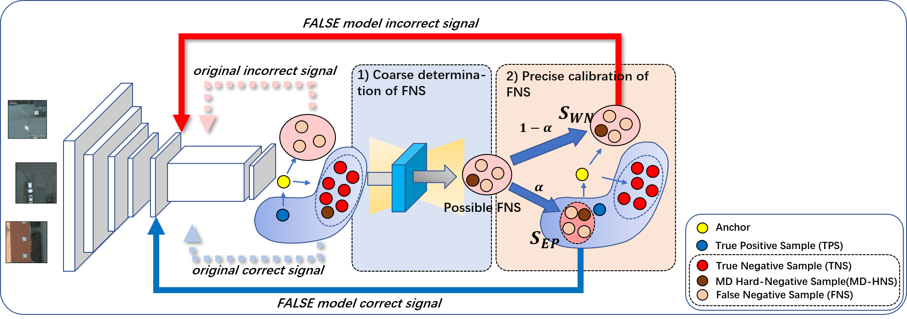

# FALSE

## False Negative Samples Aware Contrastive Learning for Semantic Segmentation of High-Resolution Remote Sensing Image



This is a PyTorch implementation of the [FALSE](https://ieeexplore.ieee.org/document/9954056)
> arXiv preprint: [arXiV 2211.07928](https://arxiv.org/abs/2211.07928)

## Abstract

<p align="justify">
The existing self-supervised contrastive learning (SSCL) of RSI is built based on constructing positive and negative sample pairs. However, due to the richness of RSI ground objects and the complexity of the RSI contextual semantics, the same RSI patches have the coexistence and imbalance of positive and negative samples, which causing the SSCL pushing negative samples far away while pushing positive samples far away, and vice versa. We call this the sample confounding issue (SCI). To solve this problem, we propose a False negAtive sampLes aware contraStive lEarning model (FALSE) for the semantic segmentation of high-resolution RSIs. Since the SSCL pretraining is unsupervised, the lack of definable criteria for false negative sample (FNS) leads to theoretical undecidability, we designed two steps to implement the FNS approximation determination: coarse determination of FNS and precise calibration of FNS. We achieve coarse determination of FNS by the FNS self-determination (FNSD) strategy and achieve calibration of FNS by the FNS confidence calibration (FNCC) loss function. Experimental results on three RSI semantic segmentation datasets demonstrated that the FALSE effectively improves the accuracy of the downstream RSI semantic segmentation task compared with the current three models, which represent three different types of SSCL models. The mean Intersection-over-Union on ISPRS Potsdam dataset is improved by 0.7\% on average; on CVPR DGLC dataset is improved by 12.28\% on average; and on Xiangtan dataset this is improved by 1.17\% on average. This indicates that the SSCL model has the ability to self-differentiate FNS and that the FALSE effectively mitigates the SCI in self-supervised contrastive learning.

## Self-supervised Pretraining
### 1. Installation
Plese refer to [INSTALL.md](docs/INSTALL.md) for installation and dataset preparation.
### 2. Training 
```bash
python tools/run_distributed_engines.py config=pretrain/FALSE/false_1gpu_resnet.yaml
``` 
### 3. Set Confidence Weight $\alpha$
The default confidence weight is 1, you can change it to other value ( $0<\alpha<1$ ) , e.g. set to 0.9:
```
python tools/run_distributed_engines.py config=pretrain/FALSE/false_1gpu_resnet.yaml \
    config.LOSS.false_loss.confidence_weight=0.9
```

## Fine-tuning for semantic segmentation

The code and fine-tuning models will be uploaded soon.


## Acknowledgement

We would like to thank the [VISSL](https://github.com/facebookresearch/vissl) and [MMSegmentation](https://github.com/open-mmlab/mmsegmentation) for its open-source project.

## Citation

If our repo is useful to you, please cite our published paper as follow:
```
Bibtex
@article{2022false,
    title={FALSE: False Negative Samples Aware Contrastive Learning for Semantic Segmentation of High-Resolution Remote Sensing Image},
    author={Zhang, Zhaoyang and Wang, Xuying and Mei, Xiaoming and Tao, Chao and Li, Haifeng},
    journal={IEEE Geoscience and Remote Sensing Letters}, 
    doi={10.1109/LGRS.2022.3222836}
    year={2022},
    type = {Journal Article}
}

Endnote
%0 Journal Article
%A Zhang, Zhaoyang
%A Wang, Xuying
%A Mei, Xiaoming
%A Tao, Chao
%A Li, Haifeng
%D 2022
%T False: False Negative Samples Aware Contrastive Learning for Semantic Segmentation of High-Resolution Remote Sensing Image
%B IEEE Geoscience and Remote Sensing Letters
%R 10.1109/LGRS.2022.3222836
%! False: False Negative Samples Aware Contrastive Learning for Semantic Segmentation of High-Resolution Remote Sensing Image
```
